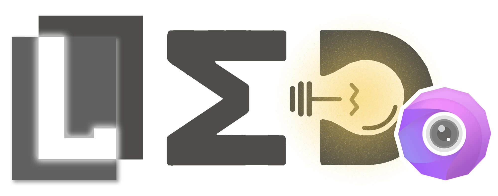

# <div align="center"> Let's Prepare for <a href="https://mipi-challenge.org/MIPI2024/">MIPI@2024</a>! \[<a href="/tools/mipi_starting_kit">Starting-Kit</a>\] </div>

<p align="center">
  <br/>
</p>

## <div align="center"><a href="https://srameo.github.io/projects/led-extension/">Homepage</a> | <a href="https://arxiv.org/abs/2308.03448v2">Paper</a> | <a href="https://drive.google.com/drive/folders/11MYkjzbPIZ7mJbu9vrgaVC-OwGcOFKsM?usp=sharing">Google Drive</a> | <a href="https://pan.baidu.com/s/17rA_8GvfNPZJY5Zl9dyILw?pwd=iay5">Baidu Cloud</a> | <a href="https://zhuanlan.zhihu.com/p/648242095">知乎</a> | <a href="https://github.com/Srameo/LED/files/12733867/iccv23_poster.pdf">Poster</a> | <a href="https://srameo.github.io/projects/led-iccv23/assets/slides/iccv23_slides_en.pdf">Slides</a> | <a href="https://youtu.be/Jo8OTAnUYkU">Video</a> </div>

<div align="center">

:newspaper:[**News**](#newspaper-news) | :wrench:[**Install**](#wrench-dependencies-and-installation) | :sparkles:[**Models Zoo**](#sparkles-pretrained-models) | :camera:[**Quick Demo**](#camera-quick-demo) | :robot:[**Benchmark**](docs/benchmark.md) | :construction:[**Contribute**](docs/develop.md) | :scroll:[**License**](#scroll-license) | :question:[**FAQ**](https://github.com/Srameo/LED/issues?q=label%3AFAQ+)

</div>

<!-- # :bulb: LED: Lighting Every Darkness in Two Pairs! -->

This repository contains the official implementation of the following papers:
> Lighting Every Darkness in Two Pairs: A Calibration-Free Pipeline for RAW Denoising<br/>
> [Xin Jin](https://srameo.github.io)<sup>\*</sup>, [Jia-Wen Xiao](https://github.com/schuy1er)<sup>\*</sup>, [Ling-Hao Han](https://scholar.google.com/citations?user=0ooNdgUAAAAJ&hl=en), [Chunle Guo](https://mmcheng.net/clguo/)<sup>\#</sup>, [Ruixun Zhang](https://www.math.pku.edu.cn/teachers/ZhangRuixun%20/index.html), [Xialei Liu](https://mmcheng.net/xliu/), [Chongyi Li](https://li-chongyi.github.io/)<br/>
> (\* denotes equal contribution. \# denotes the corresponding author.)<br/>
> In ICCV 2023, \[[Paper Link](https://arxiv.org/abs/2308.03448v1)\]

> Make Explicit Calibration Implicit: Calibrate Denoiser Instead of the Noise Model<br/>
> [Xin Jin](https://srameo.github.io), [Jia-Wen Xiao](https://github.com/schuy1er), [Ling-Hao Han](https://scholar.google.com/citations?user=0ooNdgUAAAAJ&hl=en), [Chunle Guo](https://mmcheng.net/clguo/)<sup>\#</sup>, [Xialei Liu](https://mmcheng.net/xliu/), [Chongyi Li](https://li-chongyi.github.io/), [Ming-Ming Cheng](https://mmcheng.net/cmm/)<sup>\#</sup><br/>
> (\# denotes corresponding authors.)<br/>
> arxiv preprint, \[[Paper Link](https://arxiv.org/abs/2308.03448v2)\]

<details>
<summary>Comparaison with Calibration-Based Method</summary>

Some brief introduction on the process of calibration in [<a href='https://github.com/Srameo/LED/blob/main/docs/calib_en.md'>EN</a>/<a href='https://github.com/Srameo/LED/blob/main/docs/calib_cn.md'>CN</a>].


</details>

LED is a **Calibration-Free** (or called implicit calibration) Pipeline for RAW Denoising (currently for extremely low-light conditions).

So tired of calibrating the noise model? Try our LED!<br/>
Achieveing <b style='font-size: large'>SOTA performance</b> in <b style='font-size: large'>2 paired data</b> and <b style='font-size: large'>training time less than 4mins</b>!

<table>
  <tbody>
    <tr><td>
    </td><td></td></tr>
    <tr><td><details><summary>More Teaser</summary></details></td>
    <td><details><summary>More Teaser</summary></details></td></tr>
  </tbody>
</table>

- First of all, [:wrench: Dependencies and Installation](#wrench-dependencies-and-installation).
- For **academic research**, please refer to [pretrained-models.md](docs/pretrained-models.md) and [:robot: Training and Evaluation](#robot-training-and-evaluation).
- For **further development**, please refer to [:construction: Further Development](#construction-further-development).
- For **using LED on your own camera**, please refer to [:sparkles: Pretrained Models](#sparkles-pretrained-models) and [:camera: Quick Demo](#camera-quick-demo).

## :newspaper: News

> Future work can be found in [todo.md](docs/todo.md).

<ul>
  <li><b>Jan 13, 2024</b>: Release the <a href="/tools/mipi_starting_kit">starting-kit</a> for <a href="https://mipi-challenge.org/MIPI2024/">MIPI@2024</a>. Additionally, we release the pre-trained parameters of Restormer and NAFNet.</li>
  <li><b>Dec 27, 2023</b>: Update an extension version of our ICCV 23 paper (<a href="https://srameo.github.io/projects/led-extension/">Project Page</a>/<a href="https://arxiv.org/abs/2308.03448v2">Paper</a>).</li>
  <li><b>Dec 1-5, 2023</b>: Add the related code/doc[<a href='https://github.com/Srameo/LED/blob/main/docs/calib_en.md'>EN</a>/<a href='https://github.com/Srameo/LED/blob/main/docs/calib_cn.md'>CN</a>] from <a href="https://github.com/Srameo/LED/pull/14">PR#14</a>/<a href="https://github.com/Srameo/LED/pull/16">PR#16</a>, thanks to @<a href="https://github.com/HYX20011209">HYX20011209</a></li>
  <li><b>Sep 27, 2023</b>: Add the urls to our <a href="https://github.com/Srameo/LED/files/12733867/iccv23_poster.pdf">Poster</a>, <a href="https://srameo.github.io/projects/led-iccv23/assets/slides/iccv23_slides_en.pdf">Slides</a>, and <a href="https://youtu.be/Jo8OTAnUYkU">Video</a>.</li>
  <li><b>Aug 19, 2023</b>: Release relevent files on <a href="https://pan.baidu.com/s/17rA_8GvfNPZJY5Zl9dyILw?pwd=iay5">Baidu Clould</a>(pwd: iay5).</li>
</ul>
<details>
  <summary>History</summary>
  <ul>
    <li><b>Aug 15, 2023</b>: For faster benchmark, we released the relevant files in commit <a href="https://github.com/Srameo/LED/commit/fadffc7282b02ab2fcc7fbade65f87217b642588"><code>fadffc7</code></a>.</li>
    <li><b>Aug, 2023</b>: We released a Chinese explanation of our paper on <a href="https://zhuanlan.zhihu.com/p/648242095">知乎</a>.</li>
    <li><b>Aug, 2023</b>: Our code is publicly available!</li>
    <li><b>July, 2023</b>: Our paper "Lighting Every Darkness in Two Pairs: A Calibration-Free Pipeline for RAW Denoising" has been accepted by ICCV 2023.</li>
  </ul>
</details>


## :wrench: Dependencies and Installation

1. Clone and enter the repo:
   ```bash
   git clone https://github.com/Srameo/LED.git ICCV23-LED
   cd ICCV23-LED
   ```
2. Simply run the `install.sh` for installation! Or refer to [install.md](docs/install.md) for more details.
   > We use the customized rawpy package in [ELD](https://github.com/Vandermode/ELD), if you don't want to use it or want to know more information, please move to [install.md](docs/install.md)
   ```bash
   bash install.sh
   ```
3. Activate your env and start testing!
   ```bash
   conda activate LED-ICCV23
   ```

## :sparkles: Pretrained Models
> If your requirement is for **academic research** and you would like to benchmark our method, please refer to [pretrained-models.md](docs/pretrained-models.md), where we have a rich variety of models available across a diverse range of methods, training strategies, pre-training, and fine-tuning models.

We are currently dedicated to training an exceptionally capable network that can generalize well to various scenarios using <strong>only two data pairs</strong>! We will update this section once we achieve our goal. Stay tuned and look forward to it!<br/>
Or you can just use the following pretrained LED module for custumizing on your own cameras! (please follow the instruction in [Quick Demo](#quick-demo)).

<table>
<thead>
  <tr>
    <th> Method </th>
    <th> Noise Model </th>
    <th> Phase </th>
    <th> Framework </th>
    <th> Training Strategy </th>
    <th> Additional Dgain (ratio) </th>
    <th> Camera Model </th>
    <th> Validation on </th>
    <th> :link: Download Links </th>
    <th> Config File </th>
  </tr>
</thead>
<tbody>
  <tr>
    <td>LED</td>
    <th> ELD (5 Virtual Cameras) </th>
    <th> Pretrain </th>
    <th> UNet </th>
    <th> PMN </th>
    <th> 100-300 </th>
    <th> - </th>
    <th> - </th>
    <th> [<a href="https://drive.google.com/file/d/1FSXp_vJxbo8_dbMJPiA33DZfagn1ExHA/view?usp=drive_link">Google Drive</a>] </th>
    <th> [<a href="/options/LED/pretrain/MM22_PMN_Setting.yaml">options/LED/pretrain/MM22_PMN_Setting.yaml</a>] </th>
  </tr>
  <tr>
    <td>LED</td>
    <th> ELD (5 Virtual Cameras) </th>
    <th> Pretrain </th>
    <th> UNet </th>
    <th> ELD </th>
    <th> 100-300 </th>
    <th> - </th>
    <th> - </th>
    <th> [<a href="https://drive.google.com/file/d/1kIN_eyNd4mlKhPV4PMmgzaoE3ddagjNU/view?usp=drive_link">Google Drive</a>] </th>
    <th> [<a href="/options/LED/pretrain/CVPR20_ELD_Setting.yaml">options/LED/pretrain/CVPR20_ELD_Setting.yaml</a>] </th>
  </tr>
  <tr>
    <td>LED</td>
    <th> ELD (5 Virtual Cameras) </th>
    <th> Pretrain </th>
    <th> UNet </th>
    <th> ELD </th>
    <th> 1-200 </th>
    <th> - </th>
    <th> - </th>
    <th> [<a href="https://drive.google.com/file/d/1IzOkJuHWQVXmkzFJzQ9-gkPXBlrutO2p/view?usp=drive_link">Google Drive</a>] </th>
    <th> [<a href="/options/LED/pretrain/CVPR20_ELD_Setting_Ratio1-200.yaml">options/LED/pretrain/CVPR20_ELD_Setting_Ratio1-200.yaml</a>] </th>
  </tr>
  <tr>
    <td>LED</td>
    <th> ELD (5 Virtual Cameras) </th>
    <th> Pretrain </th>
    <th> Restormer </th>
    <th> ELD </th>
    <th> 100-300 </th>
    <th> - </th>
    <th> - </th>
    <th> [<a href="https://drive.google.com/file/d/1iKNLaNRH5UejstaZbuq83yAdYxLaPa4x/view?usp=drive_link">Google Drive</a>] </th>
    <th> [<a href="/options/LED/other_arch/Restormer/LED+Restormer_Pretrain.yaml">options/LED/other_arch/Restormer/LED+Restormer_Pretrain.yaml</a>] </th>
  </tr>
  <tr>
    <td>LED</td>
    <th> ELD (5 Virtual Cameras) </th>
    <th> Pretrain </th>
    <th> NAFNet </th>
    <th> ELD </th>
    <th> 100-300 </th>
    <th> - </th>
    <th> - </th>
    <th> [<a href="https://drive.google.com/file/d/1FmqGv_YICLX4Gc-aWzvcTl8aWgeJ5cEB/view?usp=drive_link">Google Drive</a>] </th>
    <th> [<a href="/options/LED/other_arch/NAFNet/LED+NAFNet_Pretrain.yaml">options/LED/other_arch/NAFNet/LED+NAFNet_Pretrain.yaml</a>] </th>
  </tr>
</table>

## :camera: Quick Demo

### Get Clean Images in the Dark!

We provide a script for testing your own RAW images in [image_process.py](scripts/image_process.py). <br/>
You could run `python scripts/image_process.py --help` to get detailed information of this scripts.
> If your camera model is one of {Sony A7S2, Nikon D850}, you can found our pretrained model in [pretrained-models.md](docs/pretrained-models.md).
>
> **Notice that**, if you wish to use the model from release v0.1.1, you need to add the `-opt` parameter: For NAFNet, add `-opt options/base/network_g/nafnet.yaml`. For Restormer, add `-opt options/base/network_g/restormer.yaml`.
```bash
usage: image_process.py [-h] -p PRETRAINED_NETWORK --data_path DATA_PATH [--save_path SAVE_PATH] [-opt NETWORK_OPTIONS] [--ratio RATIO] [--target_exposure TARGET_EXPOSURE] [--bps BPS] [--led]

optional arguments:
  -h, --help            show this help message and exit
  -p PRETRAINED_NETWORK, --pretrained_network PRETRAINED_NETWORK
                        the pretrained network path.
  --data_path DATA_PATH
                        the folder where contains only your raw images.
  --save_path SAVE_PATH
                        the folder where to save the processed images (in rgb), DEFAULT: 'inference/image_process'
  -opt NETWORK_OPTIONS, --network_options NETWORK_OPTIONS
                        the arch options of the pretrained network, DEFAULT: 'options/base/network_g/unet.yaml'
  --ratio RATIO, --dgain RATIO
                        the ratio/additional digital gain you would like to add on the image, DEFAULT: 1.0.
  --target_exposure TARGET_EXPOSURE
                        Target exposure, activate this will deactivate ratio.
  --bps BPS, --output_bps BPS
                        the bit depth for the output png file, DEFAULT: 16.
  --led                 if you are using a checkpoint fine-tuned by our led.
```

### Fine-tune for Your Own Camera!

> A detailed doc can be found in [issue#8](https://github.com/Srameo/LED/issues/8).

1. Collect noisy-clean image pairs for your camera model, please follow the insruction in [demo.md](docs/demo.md).
2. Select a **LED Pretrained** model in our [model zoo](docs/pretrained-models.md) (based on the additional dgain you want to add on the image), and fine-tune it using your data!
   ```bash
   python scripts/cutomized_denoiser.py -t [TAG] \
                                        -p [PRETRAINED_LED_MODEL] \
                                        --dataroot your/path/to/the/pairs \
                                        --data_pair_list your/path/to/the/txt
   # Then the checkpoints can be found in experiments/[TAG]/models
   # If you are a seasoned user of BasicSR, you can use "--force_yml" to further fine-tune the details of the options.
   ```
3. Get ready and test your denoiser! (move to [Get Clean Images in the Dark!](#get-clean-images-in-the-dark)).

## :robot: Training and Evaluation

Please refer to [benchmark.md](docs/benchmark.md) to learn how to benchmark LED, how to train a new model from scratch.

## :construction: Further Development

If you would like to develop/use LED in your projects, welcome to let us know. We will list your projects in this repository.<br/>
Also, we provide useful tools for your futher development, please refer to [develop.md](docs/develop.md).


## :book: Citation

If you find our repo useful for your research, please consider citing our paper:

```bibtex
@inproceedings{jiniccv23led,
    title={Lighting Every Darkness in Two Pairs: A Calibration-Free Pipeline for RAW Denoising},
    author={Jin, Xin and Xiao, Jia-Wen and Han, Ling-Hao and Guo, Chunle and Zhang, Ruixun and Liu, Xialei and Li, Chongyi},
    journal={Proceedings of the IEEE/CVF International Conference on Computer Vision},
    year={2023}
}

@inproceedings{jin2023make,
  title={Make Explict Calibration Implicit: "Calibrate" Denoiser Instead of The Noise Model},
  author={Jin, Xin and Xiao, Jia-Wen and Han, Ling-Hao and Guo, Chunle and Liu, Xialei and Li, Chongyi and Cheng, Ming-Ming},
  journal={Arxiv},
  year={2023}
}
```

## :scroll: License

This code is licensed under the [Creative Commons Attribution-NonCommercial 4.0 International](https://creativecommons.org/licenses/by-nc/4.0/) for non-commercial use only.
Please note that any commercial use of this code requires formal permission prior to use.

## :postbox: Contact

For technical questions, please contact `xjin[AT]mail.nankai.edu.cn` and `xiaojw[AT]mail.nankai.edu.cn`.

For commercial licensing, please contact `cmm[AT]nankai.edu.cn`.

## :handshake: Acknowledgement

This repository borrows heavily from [BasicSR](https://github.com/XPixelGroup/BasicSR), [Learning-to-See-in-the-Dark](https://github.com/cchen156/Learning-to-See-in-the-Dark) and [ELD](https://github.com/Vandermode/ELD).<br/>
We would like to extend heartfelt gratitude to [Ms. Li Xinru](https://issuu.com/lerryn) for crafting the exquisite logo for our project.

We also thank all of our contributors.

<a href="https://github.com/Srameo/LED/graphs/contributors">
  
</a>
