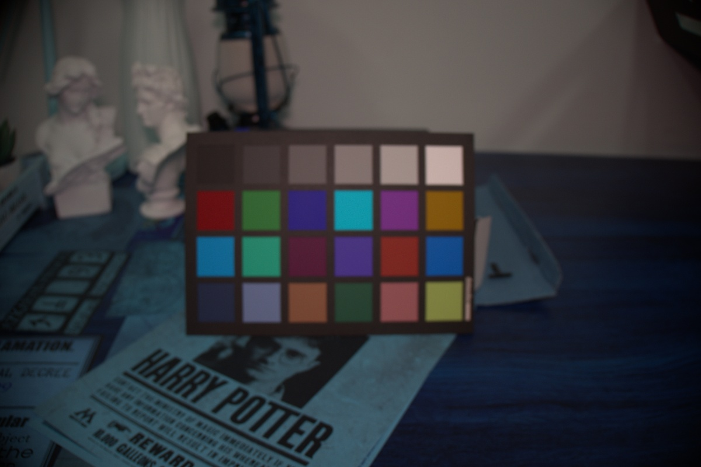
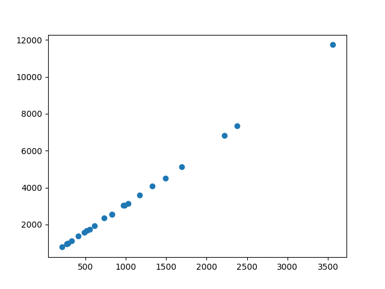
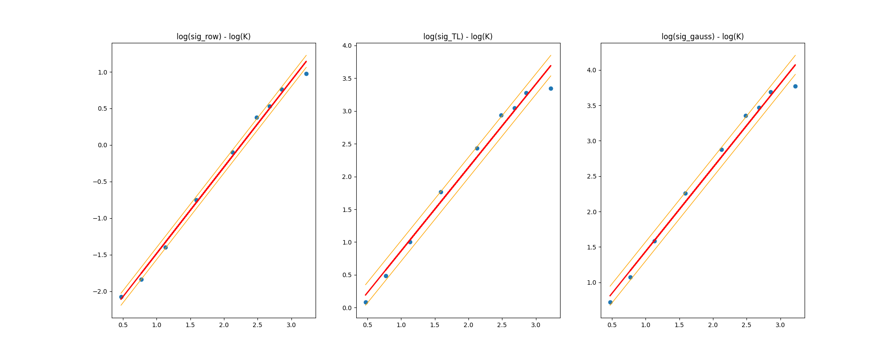

# Noise calibration

## Prerequisites 

### 1. Rawpy

The calibration code the raspy package, which can be installed based on this instructions(https://pypi.org/project/rawpy/)

Note: If rawpy cannot be installed on Mac(m1/m2), you can refer to this issue(https://github.com/letmaik/rawpy/issues/171)

### 2. data

It is recommended that you organize the data to be calibrated into  separate folders for each camera. Within each camera folder, you should  further divide the data into several subfolders based on different ISO  values.

## Data Capture and Principles

We used five different models of cameras to separately capture color cards (24 color blocks) and black images.  The color card is shown in the following image:

  

Dark images are as shown in the image below：

  

Both the color card and the black images were captured at nine different ISO values, with 15 identical images taken at each ISO value

$$\text{Var}(D) = K(K I)+\text{Var}\left(N_o\right)$$

Therefore, according to the formula mentioned in ELD[^1], it is equivalent  to obtaining 24 sets of different data points for each color card image  under each ISO. Hence, we can fit a straight line and obtain the K and the signal-independent noise for the current camera at the  current ISO：

  

Next, we obtain other parameters based on the captured dark images. Firstly, we can derive the distribution parameters of the sum of Read Noise (assuming it follows a TL distribution or a Gaussian distribution) and row noise by calculating the mean and variance of the entire image. Subsequently, we can obtain the parameters for the two assumptions where the Read Noise follows either a TL distribution or a Gaussian distribution.

Finally, according to the formula in ELD[^1]:

$$\log (\sigma_{TL}) \mid \log (K) \sim \mathcal{N}(a_{TL} \log (K)+b_{TL}, \hat{\sigma}_{TL})$$

$$\log (\sigma_r) \mid \log (K) \sim \mathcal{N}(a_r \log (K)+b_r, \hat{\sigma}_r)$$

We can use the K and distribution parameters obtained for each camera at different ISO levels as data points to fit a logarithmic linear relationship between them：

  

## calibration process

For the calibration process, you can execute all steps at once by  directly following the code given in the main function, or you can  perform each step separately according to your needs. These steps  include selecting the positions of color blocks, calibrating the color  blocks to obtain K, calibrating dark images to obtain other parameters, and fitting log(K) and log(variance).

## Acknowledgments

This code is based on the related works of ELD and PMN. We hereby  express our gratitude to the authors and contributors of ELD[^1] and  PMN[^2]!

[^1]: 1https://arxiv.org/abs/2108.02158

[^2]: https://github.com/megvii-research/PMN/tree/TPAMI

